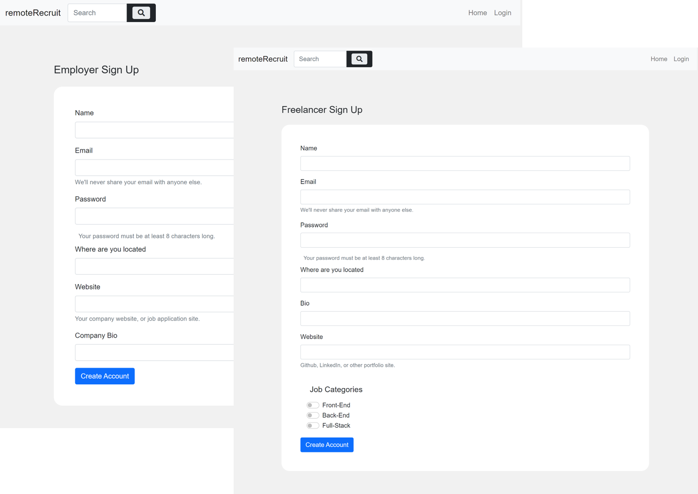
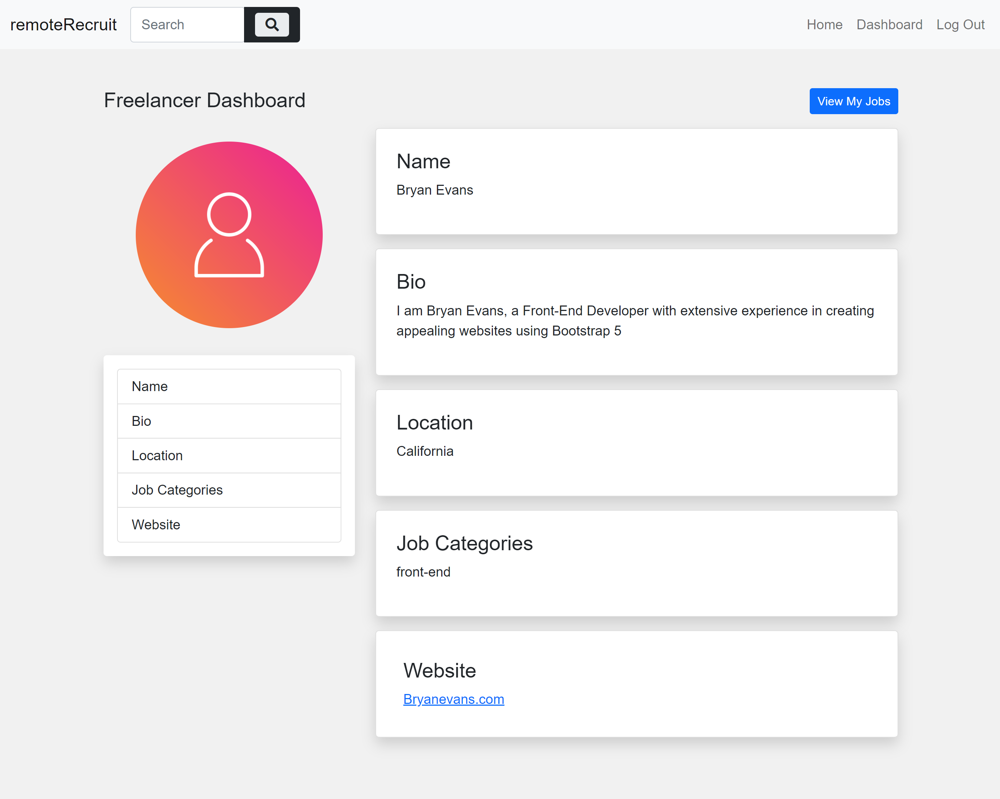
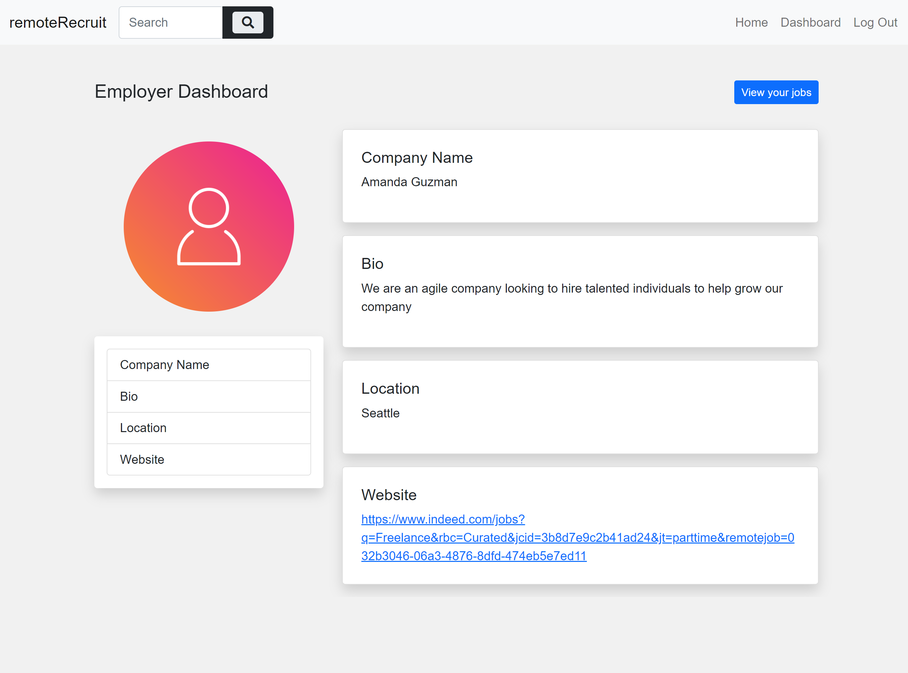
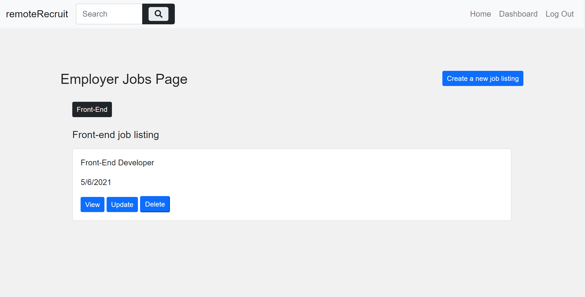
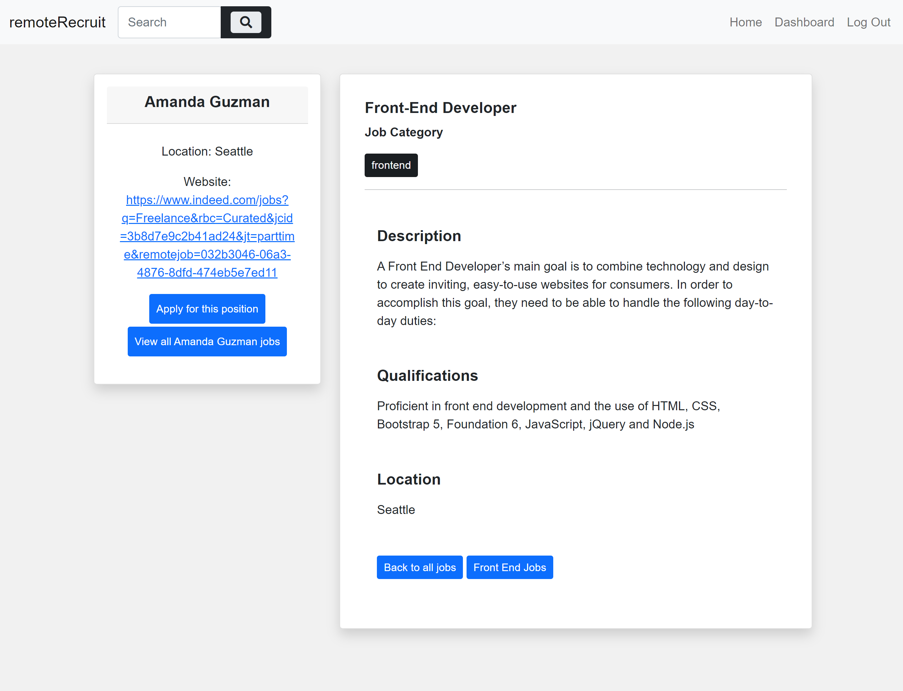

# remoteRecruit
## Description
remoteRecruit is a full-stack application that is built with the user in mind, remoteRecrit is an application that allows its users to find the perfect job match.

The application is built as a mobile first application with an intuative, clean and polished UI.

remoteRecruit is deployed on Heroku through the following link [remoteRecruit](https://remote-recruit.herokuapp.com/)

## Table of Contents

[Description](#description)

[Technologies-&-tools-used](#Technologies-&-tools-used)

[Local-Installation](#Local-Installation)

[Invoking-the-application-locally](#Invoking-the-application-locally)

[Usage](#usage)

[remoteRecruit-Features](#remoteRecruit-Features)

[Responsive-Design](#Responsive-Design)

[Future-Development](#Future-Development)

[Team-Members](#Team-Members)

[License](#License)

[Badges](#Badges)

[Contributing](#Contributing)

[Tests](#tests)

[Deployed-Link](#deployed-link)

[Questions](#questions)

## Technologies & tools used
1. HTML 5
2. Bootstarp 5/ CSS3
3. JavaScript
4. Node.js
5. Handlebars 
6. Dependencies:
    * bcrypt
    * dotenv
    * mysql2
    * sequelize
    * connect-session-sequelize
    * express 
    * express-handlebars
    * express-session
    * minisearch

## Local Installation
To install the application locally follow the following steps:

1. Clone the repository from github 
2. Install the following npm packages:
    * [bcrypt](https://www.npmjs.com/package/bcrypt) throught the command `npm install bcrypt`
    * [dotenv](https://www.npmjs.com/package/dotenv) throught the command `npm install dotenv` 
    * [mysql2](https://www.npmjs.com/package/mysql2) throught the command `npm install --save mysql2`
    * [sequelize](https://www.npmjs.com/package/sequelize) throught the command `npm i sequelize`
    * [connect-session-sequelize](https://www.npmjs.com/package/connect-session-sequelize) throught the command `npm install connect-session-sequelize`
    * [express](https://www.npmjs.com/package/express) throught the command `npm install express`
    * [express-handlebars](https://www.npmjs.com/package/express-handlebars) throught the command `npm install express-handlebars`
    * [express-session](https://www.npmjs.com/package/express-session) throught the command `npm install express-session`
    * [minisearch](https://www.npmjs.com/package/minisearch) throught the command `npm install --save minisearch`

## Invoking the application locally
To invoke the application locally follow the following steps:

* Right click on the `<server.js>` file and open the built in integrated terminal in MVC and type the following commands:

* Type `mysql -u username -p` (note that the username is your own username on MySQL Workbench)
* Enter the password when prompted (note that the password is your password on MySQL Workbench)
* Type `source ./db/schema.sql` to create the database
* Type `exit`
* Type the command `npm run seed` or `node seeds/seed.js`to seed the database
To check the database that has been created open MySQL Workbench and check the database and its associated tables for testing.
* Type the command `npm start` or `node server.js` to connect the application to the server and start the application

## Usage
remoteRecruit caters for 2 different types of users:
1. Freelancer
2. Employer

### Freelancer
remoteRecruit provides the freelancer user of the application with the ability to:
1. Sign up as a Freelancer (if they do not have a profile)
    When the Freelancer signs up they are prompted to fill in the sign up form which builds the freelancer (user) profile/dashboard, this includes the following information
    * Name
    * email
    * Password (must be 8 characters long)
    * Bio
    * Location
    * Website (ex. github profile)
    * Job Categories, provides the user with the option to chose multiple options from the switches provided 

2. Log in (in case they already have a profile)
    * the user is prompted to log in using their email and password
4. Once the Freelancer is logged in, the navigation menu provides the option to chose to visit their prsonal dashboard which reflects the information provided during the sign up

As a freelancer, the user is able to create their profile, view jobs that are available on the homepage and also search for any job or employer using the searchbar provided in the navigation.

### Employer
remoteRecruit provides the Employer user of the application with the ability to:
1. Sign up as an Employer (if they do not have a profile)
    When the Employer signs up they are prompted to fill in the sign up form which builds the Employer (user) profile/dashboard, this includes the following information
    * Name
    * email
    * Password (must be 8 characters long)
    * Location
    * Website (Comapny website)
    * Company Bi 

2. Log in (in case they already have a profile)
    * the user is prompted to log in using their email and password
4. Once the Employer is logged in, the navigation menu provides the option to chose to visit their prsonal dashboard which reflects the information provided during the sign up

In the current phase of the application the EMployer has the ability to create a new job listing through the crate job listing button in their personal dashboard. 

Creating a new job listing prompts the Employer to fill out a form with the job listing following information:
* Job Title
* Description
* Qualifications
* Where is the job located
* Enter the job application website
* What skill set is this job for 
The skill set section provides the Emoployer with the option to chose which skill set it belongs to

Once the job is created it can be viewed on the Employer Jobs Page and more jobs can be created through the same page. The job listings that belong to the Employer can be viewed or deleted at this version of the application. 

Viewing the job listing provides the application user with the ability to visit the employer website, go back to view all jobs related to this particular employer or view all the jobs that belong to the same category. 

## remoteRecruit Features
### Homepage
The Homepage is designed for easy navigation and to provide the user with the best experience. The Homepage includes the following components:
**Navbar**
1. Logo which is clickable and redirects the user to the Homepage
2. Search Box which uses minisearch npm package in the backend 
3. Home
4. Login

**Hero Image**
The section that displays the hero image also displays two buttons to sign up either as a freelancer or as an employer

**Main**
The main section of the website provides a list of latest jobs posted throughout the website which can be viewed without sign up or login. The Latest Jobs are displayed in a categorized way which bundles each category separately under its related title and buttons are provided on the top of all the listings for easy nagivation. If the user wishes to view all the jobs that are under one category they can click on view all or the title which all jobs are listed under.

### Sign up page
Upon clicking on sign up either as a freelancer or as an employer the user will be redirected to the sign up page related where the user will fill out a form that eventually builds and populates the user profile/dashboard. The fields in each form varies based on the type of user signing up.

### Freelancer Dashboard
Once the Freelancer signs up, the navigation bar will display a Dashboard Item where the user can view their profile/dashboard.

### Employer Dashboard
Once the Employer signs up, the navigation bar will display a Dashboard Item where the user can view their profiile/dashboard. The Employer dashboard provides the user with the ability to view all jobs created by them.

Clicking on the View my Jobs button redirects the user to a new page to view their current posted jobs or create a new one. 

### Create job listing
To create a job listing, the user clicks on the create job listing button and fill out the form to create and populate the job listing.

### Employer Job Page
The employer job page provides the Employer with the ability to see all the jobs posted by them, view the details of each job or delete it. The page also provides the user with the ability to crate another job from the same page. 

### View Job Details
to view job details, the user can click on view in the employer job page and the user will be redirected to the page that is populated with the data entered by the Employer during thejob creation. The job details page provides the user with the ability to view all the jobs posted by this emloyer, open the employer website, go back to all job listings on the homepage or view all the jobs that belong to the same category.

## Responsive Design
remoteRecruit is designed using Bootstrap 5 which is one of the most advanced responsive fron-end frameworks, Book Hunt gives the user a very easy user experience on different devices with a clean and polished UI.

## Future Development
### Freelancer side:
1. Update profile information
2. Ability to favorit a job and view all jobs added to a favorit list for future reference
3. Be able to apply for a job directly from the website

### Employer Side:
1. Update profile information
2. Ability to update a job listing
3. Add potential candidates to a favorite list for future reference
4. Ability to contact the freelancer 

### General:
1. Upload a profile picture associated with the user
2. Provide Icons for job postings 
3. Expand the job categories and create chils technologies associated to each one
4. Application hosting

## Team Members
[LucBurns](https://github.com/lbburnsy)

[NohaAshraf85](https://www.github.com/NohaAshraf85)

[BrittanyPlummer](https://github.com/BrittPlum)

## License

## Badges

## Contributing 
To contribute to this project, please make sure you follow the guidelines in [The Contributor Covenant](https://www.contributor-covenant.org/) as general guidelines. kindly maintain the highest ethics and respect. 

For further questions or requests kindly contact one of the team members listed under [Team-Members](#Team-Members).

## Tests 
remoteRecruite can be tested at several stages:
Backend routes testing thgouht [Insomnia](https://insomnia.rest/)
Database testing and proper seesing at the backend through [MySQL Workbench](https://www.mysql.com/products/workbench/)
Front end testing through the deployed application on Heroku [remoteRecruit](https://remote-recruit.herokuapp.com/)

## Deployed link 
Heroku [remoteRecruit](https://remote-recruit.herokuapp.com/)

## Questions
For any questions, please contact me any of the core contributors [Team-Members](#Team-Members)

